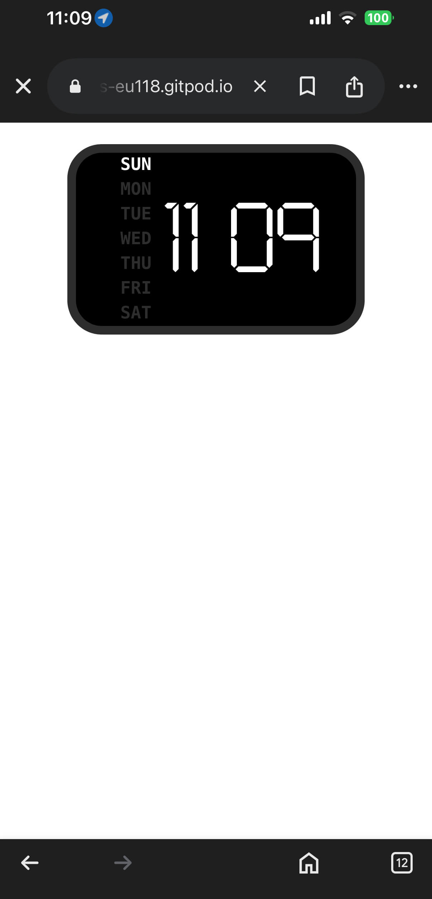
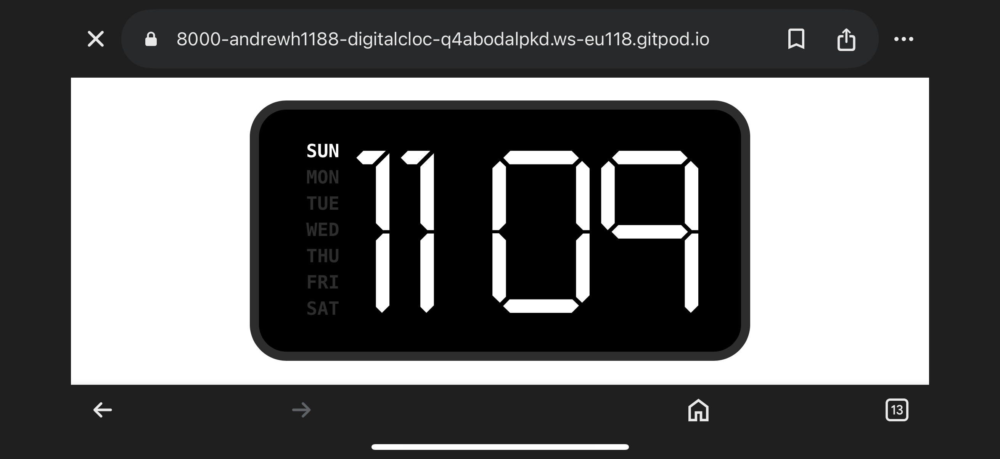
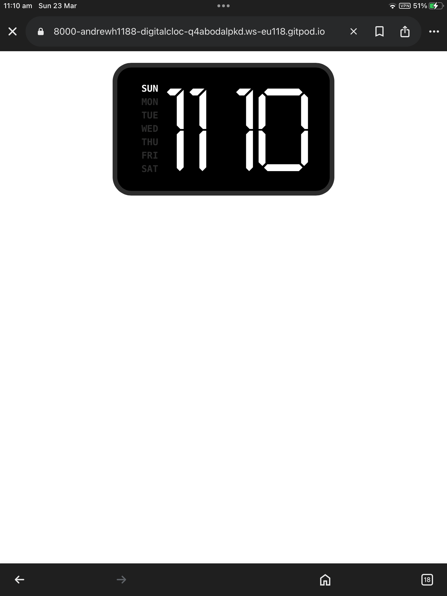
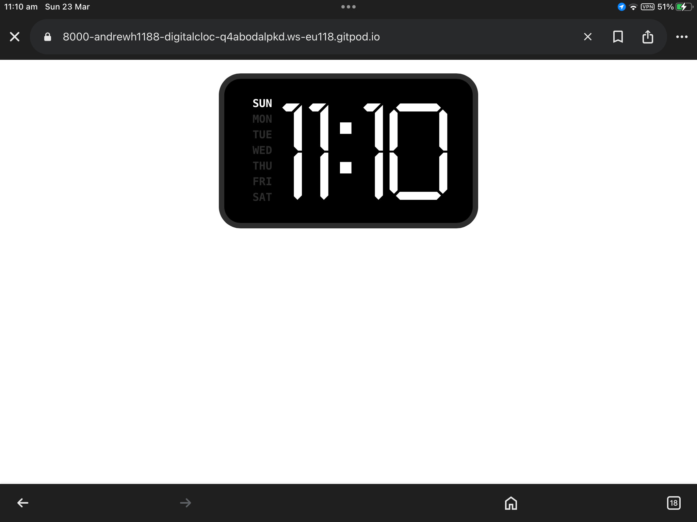
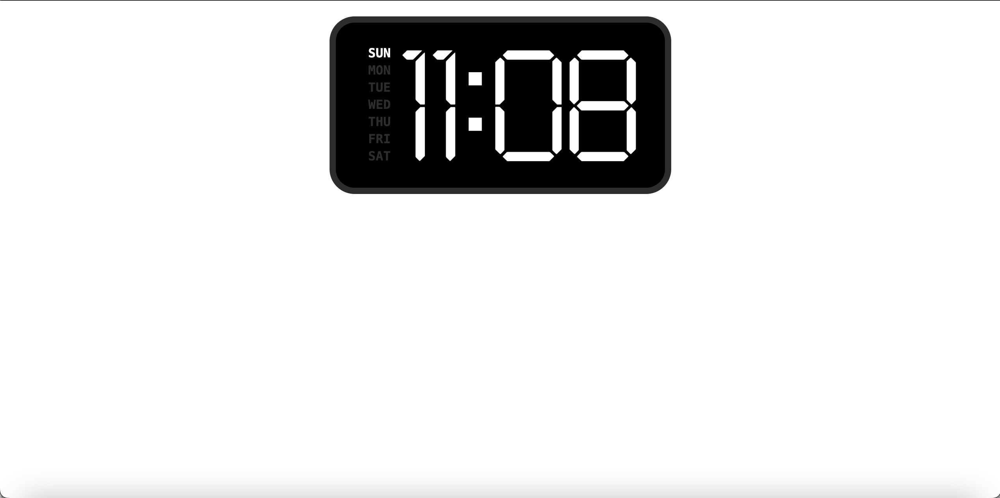

#Digital Clock

This project has been completed by following along with Instagram user
[aacoding_tips](https://www.instagram.com/reel/DHGbq7nNIdc/?igsh=MTNtaDJjM2Z5cTluZg==) video.

## Showcasing and Testing
### Mobile Portrait 

### Mobile Landscape 

### Tablet Portrait 

### Tablet Landscape 

### Desktop 

To view my version, please click [here]()

The differences between my code and aacoding_tips code is that I have added a media query to make the layout work on mobile, using SCSS for the styling and nesting the .active in with the .week, instead of .week .active as per aacoding_tips code.